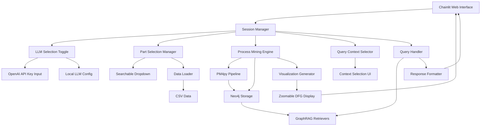

# Design Document

## Overview

This design integrates the existing process mining chatbot's core functionality with Chainlit to create a unified web-based interface. The integration will replace the command-line interface with an interactive chat interface that includes:
- Searchable dropdown part selection
- Automatic DFG visualization display with zoom functionality
- LLM selection toggle (OpenAI API vs Local LLM)
- Context-based query system requiring selection for each question
- Clean user interface without technical retrieval details

## Architecture

### High-Level Architecture



### Component Integration Strategy

The design follows a modular approach where existing components from main.py are wrapped and orchestrated through Chainlit event handlers:

1. **Session Management**: Use Chainlit's session system to maintain state across interactions
2. **Async Integration**: Wrap synchronous operations in async handlers for Chainlit compatibility
3. **Progressive Enhancement**: Start with basic functionality and add advanced features incrementally

## Components and Interfaces

### 1. Chainlit Application (app.py)

**Purpose**: Main entry point and UI orchestration
**Key Responsibilities**:
- Handle Chainlit events (`@cl.on_chat_start`, `@cl.on_message`)
- Manage user sessions and state
- Coordinate between different functional components
- Display results and visualizations
- Handle session termination keywords

**Interface**:
```python
@cl.on_chat_start
async def start_session()

@cl.on_message  
async def handle_message(message: cl.Message)

@cl.action_callback("llm_selection")
async def handle_llm_selection(action)

@cl.action_callback("part_selection")
async def handle_part_selection(action)

@cl.action_callback("context_selection")
async def handle_context_selection(action)
```

### 2. LLM Selection Manager

**Purpose**: Handle LLM selection toggle and API key management
**Key Responsibilities**:
- Provide toggle between OpenAI API and Local LLM
- Handle API key input popup for OpenAI
- Validate API keys
- Configure LLM settings

**Interface**:
```python
class LLMSelectionManager:
    async def show_llm_selector(self) -> None
    async def handle_openai_selection(self) -> None
    async def show_api_key_input(self) -> None
    async def validate_api_key(self, api_key: str) -> bool
    async def configure_llm(self, llm_type: str, api_key: str = None) -> None
```

### 3. Part Selection Manager

**Purpose**: Handle part selection with dropdown and search functionality
**Key Responsibilities**:
- Load available parts from CSV data
- Provide searchable dropdown interface using Chainlit actions
- Validate part selection
- Trigger data processing for selected part

**Interface**:
```python
class PartSelectionManager:
    async def show_searchable_dropdown(self) -> None
    async def filter_parts(self, search_term: str) -> List[str]
    async def handle_part_selection(self, selected_part: str) -> bool
    async def get_available_parts(self) -> List[str]
```

### 4. Process Mining Engine Wrapper

**Purpose**: Async wrapper around existing main.py functionality
**Key Responsibilities**:
- Execute PM4py pipeline asynchronously
- Generate both frequency and performance DFG visualizations automatically
- Store data in Neo4j
- Setup GraphRAG retrievers
- Provide progress updates to UI

**Interface**:
```python
class ProcessMiningEngine:
    async def process_data(self, selected_part: str) -> ProcessingResult
    async def generate_automatic_visualizations(self) -> Tuple[cl.Image, cl.Image]
    async def setup_retrievers(self) -> Tuple[Retriever, Retriever, Retriever]
    def cleanup_resources(self) -> None
```

### 5. Query Context Manager

**Purpose**: Handle context selection for each query
**Key Responsibilities**:
- Display context selection options before each question
- Validate context selection
- Reset context selection after each response

**Interface**:
```python
class QueryContextManager:
    async def show_context_selector(self) -> None
    async def handle_context_selection(self, context: str) -> None
    def reset_context_selection(self) -> None
    def get_available_contexts(self) -> List[str]
```

### 6. Chat Query Handler

**Purpose**: Handle natural language queries using GraphRAG
**Key Responsibilities**:
- Route queries to appropriate retrievers based on selected context
- Generate responses using selected LLM
- Format responses without technical details
- Handle session termination keywords

**Interface**:
```python
class ChatQueryHandler:
    async def handle_query(self, query: str, context_mode: str) -> str
    def check_termination_keywords(self, query: str) -> bool
    def format_clean_response(self, response: str) -> str
    async def process_with_context(self, query: str, context: str) -> str
```

### 7. Visualization Manager

**Purpose**: Handle visualization generation and display with zoom functionality
**Key Responsibilities**:
- Generate DFG and performance visualizations automatically after part selection
- Provide zoomable image display in Chainlit
- Convert images for web display
- Manage temporary files
- Provide download links for exports

**Interface**:
```python
class VisualizationManager:
    async def generate_automatic_dfgs(self, dfg_data, performance_data) -> Tuple[cl.Image, cl.Image]
    async def create_zoomable_image(self, image_path: str, title: str) -> cl.Image
    async def export_data(self, export_type: str) -> cl.File
    def cleanup_temp_files(self) -> None
```

## Data Models

### Session State Model

```python
@dataclass
class SessionState:
    llm_type: Optional[str] = None  # "openai" or "ollama"
    openai_api_key: Optional[str] = None
    selected_part: Optional[str] = None
    processing_complete: bool = False
    retrievers: Optional[Tuple[Retriever, Retriever, Retriever]] = None
    visualizations_displayed: bool = False
    awaiting_context_selection: bool = False
    current_context_mode: Optional[str] = None
    session_active: bool = True
```

### Processing Result Model

```python
@dataclass
class ProcessingResult:
    success: bool
    dfg_data: Optional[Dict] = None
    performance_data: Optional[Dict] = None
    chunk_counts: Dict[str, int] = field(default_factory=dict)
    error_message: Optional[str] = None
```

## Error Handling

### Error Categories and Responses

1. **Configuration Errors**
   - Missing environment variables
   - Invalid Neo4j connection
   - Missing CSV file
   - Response: Clear error message with setup instructions

2. **Data Processing Errors**
   - Invalid part selection
   - PM4py processing failures
   - Neo4j storage errors
   - Response: Retry options and fallback suggestions

3. **Query Processing Errors**
   - LLM connection failures
   - Retriever errors
   - Timeout errors
   - Response: Graceful degradation with basic functionality

4. **Resource Management Errors**
   - Memory issues
   - GPU allocation problems
   - File system errors
   - Response: Automatic cleanup and resource optimization

### Error Handling Strategy

```python
class ErrorHandler:
    async def handle_error(self, error: Exception, context: str) -> str
    def log_error(self, error: Exception, context: str) -> None
    async def suggest_recovery(self, error_type: str) -> List[str]
```

## Testing Strategy

### Unit Testing

1. **Component Testing**
   - Test each manager class independently
   - Mock external dependencies (Neo4j, LLM)
   - Validate async/sync integration

2. **Integration Testing**
   - Test Chainlit event handlers
   - Validate session state management
   - Test error propagation

3. **End-to-End Testing**
   - Simulate complete user workflows
   - Test with sample data
   - Validate visualization generation

### Test Structure

```
tests/
├── unit/
│   ├── test_part_selection_manager.py
│   ├── test_process_mining_engine.py
│   └── test_chat_query_handler.py
├── integration/
│   ├── test_chainlit_integration.py
│   └── test_session_management.py
└── e2e/
    └── test_complete_workflow.py
```

### Testing Approach

1. **Mock Strategy**: Use pytest-mock for external dependencies
2. **Async Testing**: Use pytest-asyncio for async components
3. **Chainlit Testing**: Use Chainlit's testing utilities for UI components
4. **Data Fixtures**: Create sample CSV data for consistent testing

## Implementation Phases

### Phase 1: Core Integration
- Implement LLM selection toggle with API key input
- Create searchable dropdown for part selection
- Integrate existing PM4py pipeline
- Basic session management

### Phase 2: Visualization and Processing
- Implement automatic DFG generation after part selection
- Add zoomable image display functionality
- Integrate Neo4j storage and GraphRAG setup
- Add progress indicators

### Phase 3: Query System
- Implement context selection for each query
- Integrate GraphRAG query handling
- Clean response formatting (no technical details)
- Session termination keyword handling

### Phase 4: Polish and Optimization
- Error handling and recovery
- Export functionality
- Performance optimizations
- UI/UX improvements and testing